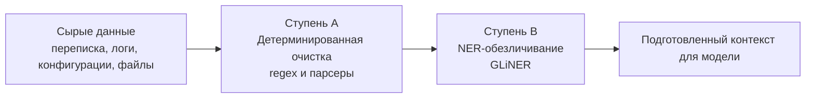

# 3.4. Слой препроцессинга данных: Архитектура и спецификация

Документ фиксирует проектное решение и техническую спецификацию для реализации **Слоя препроцессинга (Раздел 3.4)** системы OmniAI / агентов поддержки первой и второй линии.

---

## 1. Концепция простыми словами (High-Level Summary)

Слой препроцессинга работает как связка **«Дворник + Цензор со шпаргалкой»** перед отправкой любого текста во внешнюю нейросеть.

```
Сырые данные (тикет, логи, почта)
        │
        ▼
[1. Дворник (Ступень A)] ──> Выметает технический мусор, сжимает логи в 3-5 раз за 2 мс
        │
        ▼
[2. Цензор (Ступень B)]  ──> Заменяет личные данные на наклейки: «Иван» -> {{Клиент_1}}
        │                   (в памяти держит временную шпаргалку соответствий)
        ▼
[3. Внешняя нейросеть]  ──> Решает задачу без доступа к реальным персональным данным
        │
        ▼
[4. Регидрация]          ──> По шпаргалке возвращает реальные имена перед показом оператору
```

### Ключевые шаги:
1. **Ступень A (Дворник):** За миллисекунды очищает повторы тысяч строк логов, почтовые подписи (*«С уважением...»*), служебные дампы памяти.
2. **Ступень B (Цензор):** Находит имена, телефоны, email, серийники и локальные IP-адреса, заменяя их на обратимые плейсхолдеры (`{{Клиент_1}}`, `{{IP_LAN_1}}`).
3. **Шпаргалка (In-Memory Vault):** Живет только в оперативной памяти в рамках одного HTTP-запроса, никогда не пишется на диск и не попадает в логи.
4. **Обратная замена:** Ответ модели размаскируется обратно перед отображением сотруднику. Инженер видит нормальный живой текст, а во внешнюю LLM персональные данные не попадали.

---

## 2. Архитектура сквозного конвейера

Слой является единым для всех сервисов системы:
* **Виджет первой линии (L1)** в Omnidesk (`/api/chat`).
* **Агент глубокой диагностики (L2)** при анализе системных логов и файлов проектов.
* **Автоклассификатор тикетов** (`classifyTicket`).



**Обоснование порядка (Сначала A, затем B — ADR-6):**  
Чем чище входной текст, тем меньше токенов нужно сканировать модели GLiNER, тем ниже вероятность ложных срабатываний на техническом мусоре и тем быстрее выполняется инференс.

---

## 3. Детализация ступеней и защита качества ответов

Главное инженерное требование: **качество ответов LLM не должно деградировать**.

### Ступень A. Детерминированная очистка (Deterministic Hygiene)
*Время выполнения: 1–5 мс на CPU, без использования нейросетей, 100% покрытие модульными тестами.*

| Тип технического мусора | Опасность наивной очистки | Безопасное решение (Сохранение качества) |
|---|---|---|
| **Повторяющиеся строки логов** | Простое удаление дубликатов скрывает динамику и частоту аварии. | **Сжатие с временным окном**: сохраняется первое и последнее событие, счетчик и интервал:<br>`[14:00:01] ERR: Modbus timeout slave 2`<br>`[...повторяется 142 раза за 14:00:02–14:02:15, темп ~1.2/сек...]`<br>`[14:02:16] ERR: Modbus timeout slave 2` |
| **HEX-дампы и пакеты шин** | Удаление hex-кодов лишает L2-агента возможности проверить CRC, код функции или сбойный байт. | **Сохранение сигнатуры фрейма**: длинные дампы (>64 байт) усекаются с сохранением первых 16–24 байт заголовка:<br>`[HEX_FRAME: 01 03 00 00 00 02 C4 0B ... (всего 512 байт, Modbus Read)]` |
| **Хеши и GUID/UUID** | Слепое удаление стирает идентификаторы каналов контроллера, GUID панелей и устройств. | GUID заменяются на типизированные ссылки `{{GUID_1}}`, сохраняя связи в коде. Очищаются только сервисные `TraceId` заголовков. |
| **Почтовые цитаты** | Срезание цитат удаляет инлайн-ответы клиента внутри тела письма. | AST-парсер вырезает повторяющиеся блоки предыдущих сообщений, но сохраняет добавленный клиентом текст. |
| **Верстка и футеры** | Удаление пробелов ломает отступы в логах Python/YAML/JS. | Удаляются только zero-width spaces (`\u200B`), ANSI-коды терминала, хвостовые подписи (*«Отправлено с iPhone»*, дисклеймеры конфиденциальности). |

---

### Ступень B. NER-обезличивание на базе GLiNER
*Время выполнения: 40–80 мс на CPU (через ONNX Runtime).*

GLiNER (Generalist and Lightweight Model for Named Entity Recognition) выбран из-за открытого словаря сущностей (Open-Vocabulary), высокой скорости и точной работы с техническими текстами на русском и английском языках.

#### 1. Список целевых сущностей для маскирования
* `person name` — ФИО клиентов, контактных лиц, монтажников.
* `client company` — Названия организаций и объектов заказчиков.
* `phone number` — Номера телефонов во всех форматах.
* `email` — Адреса электронной почты.
* `physical address` — Физические адреса объектов автоматизации.
* `internal ip host` — Локальные IP-адреса и корпоративные доменные имена.
* `device serial number` — Серийные номера контроллеров, MAC-адреса, лицензионные ключи.

#### 2. Главные предохранители качества (Guardrails)
1. **Domain & Protocol Allowlist (Белый список предметной области):**  
   Категорически запрещено маскировать термины автоматизации. До запуска NER текст сверяется со словарем исключений:
   * **Бренды и протоколы:** `SmartPro`, `Server UMC`, `KNX`, `Modbus`, `BACnet`, `DALI`, `HDL Buspro`, `Crestron`, `Wiren Board`, `Home Assistant`.
   * **Системные сущности:** `localhost`, `127.0.0.1`, `0.0.0.0`, `eth0`, `wlan0`.
2. **Топологически-сохранные плейсхолдеры для IP-адресов:**  
   Для сетевой диагностики критично знать, находятся ли устройства в одной подсети.
   * `192.168.1.50` $\rightarrow$ `{{IP_LAN_A_HOST_1}}`
   * `192.168.1.1` $\rightarrow$ `{{IP_LAN_A_GW}}`
   * `10.0.0.5` $\rightarrow$ `{{IP_LAN_B_HOST_2}}`  
   *Модель понимает сетевую топологию, не зная реальных адресов клиента.*
3. **Семантическая типизация:**  
   Используются понятные для LLM токены: `{{CLIENT_PERSON_1}}`, `{{CLIENT_ORG_1}}`, `{{PHONE_1}}`, не нарушающие связность русской речи.

---

## 4. Карта соответствий (In-Memory Ephemeral Vault)

Карта связей плейсхолдеров и исходных данных подчиняется строгим правилам информационной безопасности:

1. **Жизненный цикл:** Привязан к объекту HTTP-запроса (`RequestContext`). Создается при поступлении данных и уничтожается в блоке `finally` после формирования ответа.
2. **Изоляция от диска:** Карта хранится строго в RAM. Запрещено сохранение в базу данных, SQLite, Redis или файловый кэш.
3. **Защита от логирования (Log Sanitizer):** В системные логи и метрики разрешено передавать только факт маскирования (`{ maskedEntities: 4, types: ['PERSON', 'IP'] }`), но никогда сами соответствия.
4. **Непроницаемость периметра:** Во внешние API (Gemini, Claude, OpenAI) уходит исключительно обезличенный текст.

---

## 5. Программный интерфейс (TypeScript Контракт)

```typescript
export interface PreprocessingMetrics {
  originalChars: number;
  stageACleanedChars: number;
  reductionPercent: number;
  executionTimeMs: number;
  maskedCount: number;
}

export interface PreprocessingResult {
  /** Очищенный и анонимизированный текст для передачи в модель */
  processedText: string;
  /** Метрики эффективности очистки */
  metrics: PreprocessingMetrics;
  /** Функция регидрации: возвращает реальные данные в готовый ответ модели */
  restoreOutput: (modelResponseText: string) => string;
}

export interface IPreprocessingPipeline {
  process(
    rawText: string, 
    contextType: 'ticket' | 'log' | 'project_config'
  ): Promise<PreprocessingResult>;
}
```

---

## 6. План внедрения при возобновлении работы

1. **Фаза 1: Ступень A (Детерминированная очистка)**
   * Создать модуль `src/preprocessing/deterministicCleaner.ts`.
   * Реализовать парсер логов со сверткой дубликатов и сохранением таймлайн-де Rich-контекста.
   * Покрыть тестами в `test/preprocessing_stage_a.test.ts` (100% покрытие граничных условий).

2. **Фаза 2: Ступень B (GLiNER + In-Memory Vault)**
   * Развернуть микросервис/воркер GLiNER с квантованной ONNX-моделью (`gliner_multi-v2.1`, int8, ~120 МБ).
   * Реализовать `DomainAllowlist` для оборудования и протоколов автоматизации.
   * Реализовать класс `EphemeralVault` с гарантией очистки памяти после завершения запроса.

3. **Фаза 3: Сквозная интеграция**
   * Подключить препроцессинг в маршрут [`POST /api/chat`](server.ts).
   * Встроить в конвейер агента L2 при парсинге файлов проекта и логов контроллера.
   * Добавить тесты на сквозную безопасность и качество восстановления ответов.
