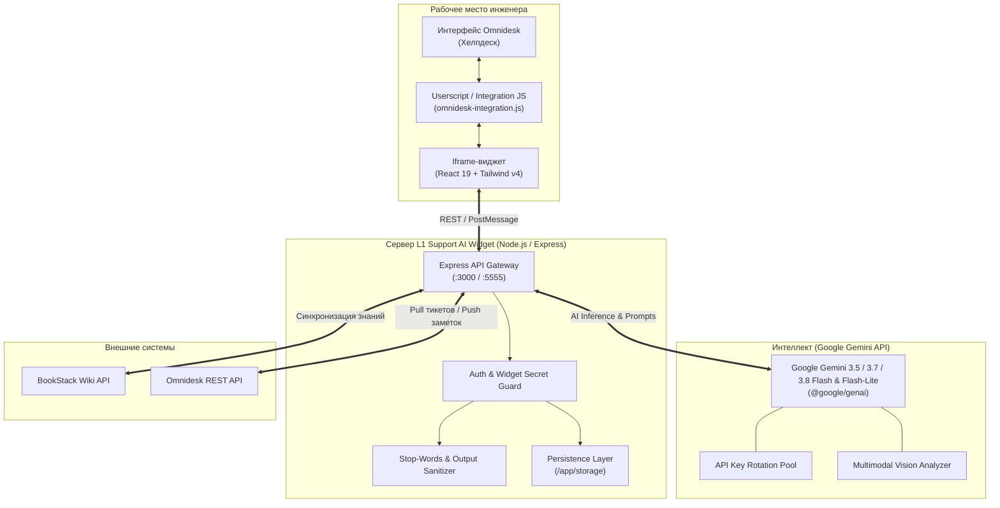
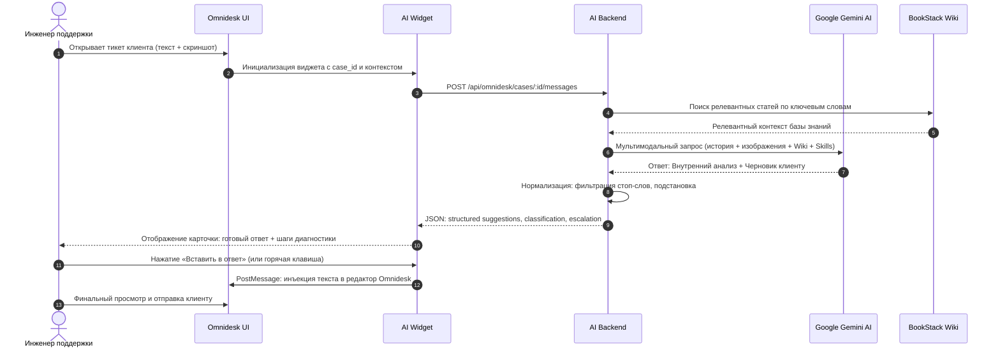

# L1 Support AI Widget — AI Copilot for Technical Support

<div align="center">

**Мультимодальный AI-copilot для инженеров и операторов первой и второй линий технической поддержки с интеграцией в Omnidesk и BookStack Wiki**

[](#стек-технологий)
[](#стек-технологий)
[](#стек-технологий)
[](#-развертывание-в-docker)
[](https://www.gnu.org/licenses/gpl-3.0)

</div>

---

## 📋 Оглавление

1. [О проекте](#-о-проекте)
2. [Ключевые возможности](#-ключевые-возможности)
3. [Архитектура системы](#-архитектура-системы)
4. [Пользовательский сценарий (Workflow)](#-пользовательский-сценарий-workflow)
5. [Спецификация API эндпоинтов](#-спецификация-api-эндпоинтов)
6. [Каталог AI-навыков (Skills Management)](#-каталог-ai-навыков-skills-management)
7. [Стек технологий](#-стек-технологий)
8. [Быстрый старт](#-быстрый-старт)
9. [Развертывание в Docker](#-развертывание-в-docker)
10. [Настройка интеграции с Omnidesk](#-настройка-интеграции-с-omnidesk)
11. [Безопасность](#-безопасность)
12. [Лицензия](#-лицензия)

---

## 🌟 О проекте

**L1 Support AI Widget** — это прикладной открытый pet-проект и AI-платформа, созданная для ускорения и стандартизации работы команд технической поддержки. Сервис встраивается напрямую в веб-интерфейс тикет-системы **Omnidesk** в виде компактного интерактивного виджета и боковой панели.

Ассистент анализирует весь контекст обращения:
- тему и полную историю сообщений клиента и оператора;
- прикрепленные скриншоты, фотографии экранов, схемы и системные логи;
- релевантные статьи базы знаний BookStack Wiki;
- регламенты коммуникации, стандарты вежливости и ограничения безопасности.

На основе анализа система формирует черновик ответа для клиента (с подстановкой номера обращения и автозаменой стоп-слов), внутренний комментарий для инженера с диагностическими шагами и готовую эскалационную заметку для профильных отделов (разработка, системные инженеры, пресейл).

---

## ⚡ Ключевые возможности

### 1. Мультимодальный анализ вложений (Gemini 3.5 / 3.7 / 3.8 Flash & Flash-Lite)
- Прямая передача скриншотов ошибок, сетевых схем, интерфейсов настройки и фотографий оборудования в визуальный контекст нейросети.
- Распознавание неразборчивых или битых файлов с автоматическим вежливым запросом четкого лога/снимка у клиента.
- **LRU-кэширование распознанных изображений:** предотвращает повторный платный анализ одних и тех же картинок при переписке в рамках тикета.

### 2. Умная инъекция ответов в Omnidesk
- Интерактивный виджет в интерфейсе Omnidesk (`omnidesk-integration.js`).
- Вставка готового текста в один клик напрямую в поле ответа клиенту или во внутреннюю заметку (`Ctrl+Enter` / кнопки быстрого действия).
- Автоматическая передача идентификатора сотрудника (`staff_id` / `staff_email`).

### 3. Автоматическая классификация обращений
- Определение продукта, типа инцидента, категории оборудования и направления автоматизации.
- Автоматическое заполнение кастомных полей тикета Omnidesk (`cf_10069`, `cf_10704` и др.).
- Формирование структурированных заметок эскалации с блоками **«Что есть»** и **«Чего не хватает»**.

### 4. Контроль тональности и стоп-слова
- Встроенный фильтр стоп-слов (`support-stop-words`): автоматическая замена негативных, конфликтных или канцелярских оборотов:
  - *«проблема»* → *«ситуация»*, *«вопрос»*, *«наблюдаемое поведение»*;
  - *«вы не правы»* → *«давайте сверим детали»*;
  - *«читайте инструкцию»* → предоставление прямой ссылки и шагов решения;
  - *«как я уже говорил»* → *«продублирую ключевые шаги»*.
- Сохранение кодовых блоков (JS, JSON, CLI-команды) без искажения синтаксиса.

### 5. Интегрированная база знаний и BookStack Sync
- Локальный полнотекстовый поиск по загруженным статьям и регламентам.
- Двусторонняя синхронизация со страницами BookStack Wiki через защищенный API-шлюз.
- Возможность импорта и обновления внешней документации.

---

## 🏗 Архитектура системы



---

## 🔄 Пользовательский сценарий (Workflow)



---

## 🔌 Спецификация API эндпоинтов

| Метод | Эндпоинт | Описание | Авторизация |
| :--- | :--- | :--- | :--- |
| `POST` | `/api/auth/login` | Аутентификация администратора | Пароль (`ADMIN_PASSWORD`) |
| `GET` | `/api/auth/status` | Проверка текущего статуса авторизации | Cookie сессии |
| `GET` | `/api/widget/config` | Публичная конфигурация виджета для Omnidesk | `X-Widget-Secret` |
| `GET` | `/api/omnidesk/widget.js` | Раздача скрипта интеграции с кешированием | Публичный |
| `POST` | `/api/omnidesk/cases/:id/messages` | Генерация ответа клиенту по истории тикета | `X-Widget-Secret` |
| `POST` | `/api/omnidesk/cases/:id/notes` | Формирование внутренней эскалационной заметки | `X-Widget-Secret` |
| `POST` | `/api/omnidesk/cases/:id/classify` | Автоматическая классификация обращения | `X-Widget-Secret` |
| `POST` | `/api/omnidesk/cases/:id/classify/apply` | Применение полей классификации в Omnidesk API | `X-Widget-Secret` |
| `GET` | `/api/omnidesk/cases/:id/history` | Получение локальной истории диалогов по тикету | `X-Widget-Secret` |
| `DELETE` | `/api/omnidesk/cases/:id/images-cache` | Сброс кеша распознанных изображений тикета | `X-Widget-Secret` |
| `POST` | `/api/chat` | Интерактивный диалог оператора с ассистентом | `X-Widget-Secret` |
| `GET` | `/api/knowledge-base` | Поиск и список статей базы знаний | Сессия администратора |
| `POST` | `/api/knowledge-base` | Добавление новой статьи в базу знаний | Сессия администратора |
| `POST` | `/api/admin/bookstack/sync` | Пакетная синхронизация с BookStack Wiki | Сессия администратора |
| `POST` | `/api/admin/skills/import` | Импорт нового агентного AI-навыка | Сессия администратора |
| `GET` | `/api/settings` | Получение настроек моделей и промптов | `X-Widget-Secret` / Сессия |
| `POST` | `/api/settings` | Сохранение настроек и пула API-ключей | Сессия администратора |
| `GET` | `/api/analytics` | Сводная аналитика работы операторов и LLM | Сессия администратора |

---

## 🧠 Каталог AI-навыков (Skills Management)

Платформа поддерживает динамическую маршрутизацию навыков (Agent Skills):

| Идентификатор навыка | Назначение | Ключевые требования |
| :--- | :--- | :--- |
| `support-ticket-classification` | Первичная классификация инцидента | Определение продукта, типа дефекта, основания по фактам. |
| `support-incident` | Обработка аварийных ситуаций и сбоев | Локализация первопричины, изоляция рисков, минимизация простоя. |
| `support-postmortem` | Составление отчетов по инцидентам (RCA) | 5 Whys, таймлайн событий, корректирующие мероприятия. |
| `support-qa-testing` | Формирование тест-кейсов и тест-планов | Шаги воспроизведения (STR), ОР/ФР, окружение, логи. |
| `support-stop-words` | Фильтрация стоп-слов и нормализация тона | Устранение обвинений клиента, замена слова «проблема». |
| `support-first-response` | Стандарт первого ответа клиенту | Обязательная подстановка `#номера тикета`, эмпатия, понятный план. |
| `support-escalation` | Маршрутизация на 2-ю линию / разработку | Формат внутренней заметки, прикрепление диагностических данных. |

---

## 🛠 Стек технологий

- **Frontend:** React 19, TypeScript, Vite 6, Tailwind CSS 4, Recharts, Lucide React.
- **Backend:** Node.js 20+, Express 4, TypeScript, tsx, esbuild, WebSocket (`ws`).
- **Искусственный интеллект:** Google Gemini API (`@google/genai`), модели семейства **Gemini 3.5 / 3.7 / 3.8 Flash** и **Flash-Lite**, поддержка пользовательских моделей.
- **Хранение данных:** Локальное персистентное JSON-хранилище (`storage/`), поддержка миграции на PostgreSQL.
- **Контейнеризация:** Docker, Docker Compose (Multi-stage сборка на базе `node:20-slim`).
- **Интеграция:** Omnidesk REST API & Userscript Bridge, BookStack REST API.

---

## 🚀 Быстрый старт

### 1. Клонирование репозитория

```bash
git clone https://github.com/Butey/L1_support_AI_Widget.git
cd L1_support_AI_Widget
```

### 2. Настройка переменных окружения

Создайте файл `.env` на основе примера:

```bash
cp .env.example .env
```

Заполните ключевые параметры в `.env`:

```env
# Ключ Google Gemini AI (обязательно)
GEMINI_API_KEY="ваш_ключ_gemini"

# Пароль для доступа в панель управления администратора
ADMIN_PASSWORD="придумайте_надежный_пароль"

# Секретный ключ для авторизации виджета Omnidesk
WIDGET_SECRET="любая_случайная_длинная_строка"
```

### 3. Локальный запуск (Разработка)

```bash
# Установка зависимостей
npm install

# Запуск dev-сервера с горячей перезагрузкой
npm run dev
```

Приложение будет доступно по адресу: **http://localhost:3000**

---

## 🐳 Развертывание в Docker

Для продакшн-окружения рекомендуется использовать Docker Compose. Dockerfile оптимизирован по потреблению оперативной памяти и запускает приложение под безопасным непривилегированным пользователем:

```bash
# Сборка и запуск контейнера в фоновом режиме
docker compose up -d --build

# Просмотр логов работы сервиса
docker compose logs -f
```

Сервер будет запущен на внешнем порту **5555** (согласно `docker-compose.yml`): **http://localhost:5555**

---

## 📬 Настройка интеграции с Omnidesk

1. Перейдите в **Omnidesk** → **Настройки** → **Кастомизация** → **Пользовательские скрипты** (или используйте расширение Tampermonkey / Chrome Extension).
2. Подключите скрипт интеграции:
   ```html
   <script src="https://your-domain.com/api/omnidesk/widget.js"></script>
   ```
3. Скрипт автоматически добавит боковую кнопку вызова AI Widget в карточке любого открытого тикета.
4. В настройках виджета укажите URL вашего сервера и `WIDGET_SECRET`.

---

## 🔒 Безопасность

- **Изоляция секретов:** Файлы `.env`, реальные базы переписок (`storage/conversations.json`) и настройки с API-ключами (`storage/settings.json`) исключены из репозитория через `.gitignore`.
- **Защита виджета:** Все запросы от виджета валидируются серверным заголовком `X-Widget-Secret`.
- **Авторизация панели:** Доступ к системным настройкам защищен надежным хешированием пароля администратора.
- **Ограничение фреймов (CSP):** Заголовок `Content-Security-Policy: frame-ancestors` ограничивает домены, которым разрешено встраивать виджет через `<iframe>`.

---

## 📜 Лицензия

Проект распространяется под свободной лицензией **GNU General Public License v3.0 (GPLv3)**. Подробности в файле [LICENSE](./LICENSE).
